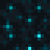

[![Contributors][contributors-shield]][contributors-url]
[![Forks][forks-shield]][forks-url]
[![Stargazers][stars-shield]][stars-url]
[![Issues][issues-shield]][issues-url]
[![MIT License][license-shield]][license-url]


<!-- PROJECT LOGO -->
<br />
<div align="center">
  <a href="https://github.com/RevolvingMadness/Sculk">
    
  </a>

<h3 align="center">Sculk</h3>

  <p align="center">
    A programming language for Minecraft
    <br />
    <a href="https://www.RevolvingMadness.github.io/Sculk"><strong>Explore the docs »</strong></a>
    <br />
    <br />
    <a href="https://github.com/RevolvingMadness/Sculk/issues">Report Bug</a>
    ·
    <a href="https://github.com/RevolvingMadness/Sculk/issues">Request Feature</a>
  </p>
</div>

### Requirements

Sculk requires [Fabric](https://www.fabricmc.net) and
the [Fabric API](https://www.curseforge.com/minecraft/mc-mods/fabric-api/files).

## Usage

One example of Sculk is the following.

```java
// load.sk
events.onPlayerBreakBlock(function(player, block) {
    if (block == Blocks.get(minecraft:diamond_block)){
        return false; // cancel the event by returning false
    }

    return true;
});
```

_For more examples, please refer to [Examples](https://RevolvingMadness.github.io/Sculk/examples)_

## Contributing

If you have a suggestion and would like to make Sculk better, please fork the repo and create a pull request. You can
also
simply open an [issue](https://github.com/RevolvingMadness/Sculk/issues) with the tag "enhancement".
Don't forget to give the project a star! Thanks again!

## License

Distributed under the MIT License. See [LICENSE](LICENSE) for more information.

## Inspiration

Sculk has been inspired from many projects listed below.

* [Code of Copper](https://modrinth.com/datapack/code-of-copper)
* [Lua Datapack](https://modrinth.com/mod/luadatapack)
* [Computer Craft Tweaked](https://modrinth.com/mod/cc-tweaked)

[contributors-shield]: https://img.shields.io/github/contributors/RevolvingMadness/Sculk.svg?style=for-the-badge

[contributors-url]: https://github.com/RevolvingMadness/Sculk/graphs/contributors

[forks-shield]: https://img.shields.io/github/forks/RevolvingMadness/Sculk.svg?style=for-the-badge

[forks-url]: https://github.com/RevolvingMadness/Sculk/network/members

[stars-shield]: https://img.shields.io/github/stars/RevolvingMadness/Sculk.svg?style=for-the-badge

[stars-url]: https://github.com/RevolvingMadness/Sculk/stargazers

[issues-shield]: https://img.shields.io/github/issues/RevolvingMadness/Sculk.svg?style=for-the-badge

[issues-url]: https://github.com/RevolvingMadness/Sculk/issues

[license-shield]: https://img.shields.io/github/license/RevolvingMadness/Sculk.svg?style=for-the-badge

[license-url]: https://github.com/RevolvingMadness/Sculk/blob/main/LICENSE
